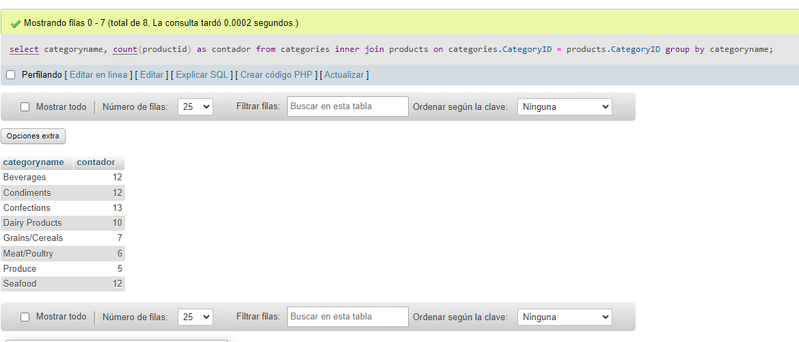

# **Examen 3 Evaluación Base de Datos**
***Marc Morlá Isern***

----

## **Enunciados Examen:**

1. Escribe una sentencia SQL que muestre el valor de todos los atributos de todos los registros de la tabla Customers.

2. Escribe una sentencia SQL que muestre el valor máximo de todos los atributos de todos los registros de la tabla Customers.

3. Escribe una sentencia SQL que muestre solo los valores de los atributos CustomerName y City de todos los registros de la tabla Customers.

4. Escribe una sentencia SQL para la tabla Customers que muestre todos los valores diferentes del atributo Country, sin mostrar duplicados.

5. Escribe una sentencia SQL que muestre los valores de todos los atriburos de la tabla Customers, pero solo de los registros donde el atributo Country valga exactamente Mexico.

6. Escribe una sentencia SQL que muestre los valores de todos los atributos de la tabla Customers, pero sol ode los registros donde el atributo Country valga Germany y simultáneamente el atributo City valga Berlin.

7. Escribe una sentencia SQL que muestre el nombre de todos los productos (ProductName) y el nombre de la categoría (CategorieName) a la que pertenece cada uno de los productos. Las categorías se encuentran en la tabla Categories y los productos en la tabla Products.

8. Escribe una sentencia SQL que muestre el nombre de todos los productos (ProductName) y el nombre de las categorías (CategorieName) a las que pertenecen cada uno de los productos así como también el nombre del proveedor (Suppliers). Las categorías se encuentran a la tabla Categories, los productos a la tabla Products y los proveedores a la tabla Suppliers.

9. Escribe una sentencia SQL que cuente el número de productos (Productos) por categorías (Categorías). Se tienen que mostrar dos columnas, CategorieName y el contador. Solo tienen que aparecer las categorías con productos. Las categorías se encuentran a la tabla Categorías, los productos en la tabla Products.

10. Escribe una sentencia SQL que cuente el número de productos (Productos) por categorías (Categorías). Solamente nos interesa contar el producto que su nombre empieza por P. Tienen que aparecer las categorías que no tienen productos. Las categorías se encuentran en la tabla Categorías, los productos en la tabla Products.

---
## **Modelo relacional:**
- Transportistas. Shippers (shipperid, shippername)
- Empleados. Employees (employeeid, employeename)
- Clientes. Customers (customerid, name, coutry)
- Proveedores. Suppliers (supplierid, suppliername)
- Categorias. Categories (categorieid, categoriename)
- Pedidos. Orders (orderid, customerid)  

## **Resultado Examen:**

1. select * from Customers;

2. select max(customerid), max(customername), max(contcatname), max(address), max(city), max(postalcode), max(coutry) from customers;

3. select CustomerName, City from customers;

4. select distinct country from customers;

5. select * from customers where Country="Mexico";

6. select * from customers where Country="Germany" and city="Berlin";

7. select ProductName, CategoryName from products inner join categories on products.CategoryID = categories.CategoryID;

8. ???

9. select categoryname, count(productid) as contador from categories inner join products on categories.CategoryID = products.CategoryID group by categoryname;

10. ???
